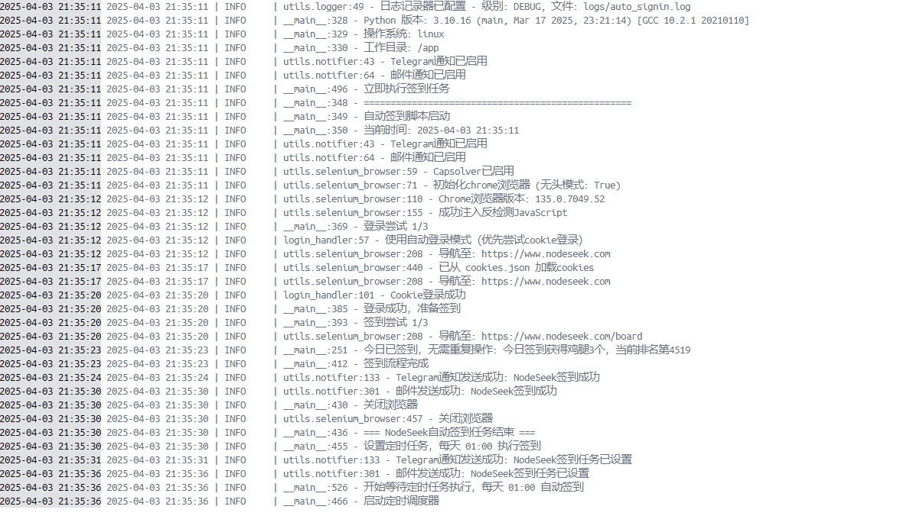

# NodeSeek 论坛自动签到程序

一个功能完善的 NodeSeek 论坛自动签到工具，支持多种登录方式、验证码处理、定时任务和通知功能。适合在服务器上长期运行

## 📸 项目预览



## 🌟 功能特点

- **多种登录方式**
  - 表单登录：使用用户名和密码
  - Cookie 登录：使用已保存的登录凭证
  - 自动模式：优先使用Cookie，失败后自动切换到表单登录

- **智能验证码处理**
  - 支持 Cloudflare Turnstile 验证码的自动识别
  - 使用 Capsolver API 服务

- **可靠的签到流程**
  - 自动导航到签到页面
  - 检测是否已签到，避免重复操作
  - 多次重试机制，提高成功率
  - 详细记录签到结果

- **定时任务支持**
  - 设置每日固定时间自动签到

- **通知功能**
  - Telegram 通知，实时获取签到状态
  - 支持成功/失败状态通知
  - 支持邮件发送

- **完善的日志记录**
  - 详细记录所有操作和结果
  - 截图保存，帮助问题诊断


## 📋 系统要求

- Python 3.10 或更高版本
- Chrome 浏览器 (自动下载驱动)
- 稳定的网络连接

## 🐧 Ubuntu环境特别说明

在Ubuntu系统上运行时，需要确保已安装Google Chrome浏览器。如果尚未安装，可以使用以下命令安装：

```bash
# 更新包列表
sudo apt update

# 安装Chrome浏览器
sudo apt install -y google-chrome-stable
```

如果您在服务器环境中运行，建议使用 Docker 部署（见下方 [Docker 部署](#-docker-部署) 部分），这样可以避免环境配置问题。

## 🔧 安装步骤

1. 克隆项目或下载源码
   ```bash
   git clone https://github.com/yourusername/nodeseek-auto-signin.git
   cd nodeseek-auto-signin
   ```

2. 安装依赖
   ```bash
   pip install -r requirements.txt
   ```

3. 配置文件设置
   ```bash
   cp config_example.py config.py
   # 编辑 config.py 文件，填入您的账号信息和其他配置
   ```

## ⚙️ 配置文件说明

`config.py` 文件包含以下主要配置项：

### 网站配置

```python
WEBSITE = {
    'name': 'nodeseek',  # 网站名称
    'url': 'https://www.nodeseek.com',  # 网站主页
    'login_url': 'https://www.nodeseek.com/signIn.html',  # 登录页面
    'signin_url': 'https://www.nodeseek.com/board',  # 签到页面
}
```

### 用户信息

```python
USER = {
    'username': 'your_username',  # 登录用户名
    'password': 'your_password',  # 登录密码
}
```

### 登录方式配置

```python
LOGIN = {
    'method': 'auto',  # 登录方式: form(表单登录)、cookie(Cookie登录)或auto(优先尝试cookie)
    'cookie_path': 'cookies.json',  # Cookie保存路径
    'save_cookie': True,  # 是否在表单登录成功后保存Cookie
}
```

### 验证码处理配置

```python
CAPSOLVER = {
    'enabled': True,  # 是否启用验证码处理
    'api_key': 'your_capsolver_api_key',  # Capsolver API密钥
    'captcha_types': {
        'turnstile': {
            'enabled': True,  # 是否启用Cloudflare Turnstile识别
            'site_key': 'turnstile_site_key',  # Turnstile site key
        }
    },
    'timeout': 60,  # 验证码识别超时时间(秒)
}
```

### 浏览器配置

```python
BROWSER = {
    'type': 'chrome',  # 浏览器类型：chrome、firefox等
    'headless': False,  # 是否使用无头模式
    'timeout': 10,  # 等待元素加载的超时时间(秒)
}
```

### 定时任务配置

```python
SCHEDULE = {
    'enabled': True,  # 是否启用定时任务
    'time': '01:00',  # 每天执行时间(24小时制)
}
```

### Telegram通知配置

```python
TELEGRAM = {
    'enabled': True,  # 是否启用Telegram通知
    'token': 'your_telegram_token',  # Telegram bot token
    'url': 'your_telegram_api_url',  # Telegram通知接口URL
}
```

### 重试配置

```python
RETRY = {
    'max_attempts': 3,  # 最大重试次数
    'delay': 5,  # 重试间隔(秒)
}
```

## 🚀 使用方法

### 基本使用

直接运行主程序：

```bash
python auto_signin.py
```

默认情况下，程序会立即执行一次签到，并设置定时任务（如果配置中启用）。


## 🐳 Docker 部署（推荐）

项目提供了 Docker 支持，便于在容器中运行，尤其适合服务器环境。

### 构建 Docker 镜像

在项目根目录下运行以下命令构建 Docker 镜像：

```bash
docker build -t nodeseek-auto-signin .
```

### 运行 Docker 容器

#### 方式一：直接运行容器

```bash
# 创建必要的目录
mkdir -p Logs Screenshots Records

# 运行容器并挂载配置文件和数据目录
docker run -d --name nodeseek-auto-signin \
  -v $(pwd)/config.py:/app/config.py \
  -v $(pwd)/Logs:/app/Logs \
  -v $(pwd)/Screenshots:/app/Screenshots \
  -v $(pwd)/Records:/app/Records \
  --restart unless-stopped \
  nodeseek-auto-signin
```

#### 方式二：使用 Docker Compose（推荐）

1. 项目已经包含了 `docker-compose.yml` 文件，可以直接使用以下命令：

```bash
docker-compose up -d
```

### Docker 部署注意事项

- Docker 容器中会自动使用无头模式运行 Chrome
- 确保 `config.py` 文件已正确配置
- 查看容器日志：`docker logs -f nodeseek-auto-signin`
- 更多详细的部署指南请参考项目中的 [DEPLOYMENT.md](DEPLOYMENT.md) 文件

## 📁 目录结构

```
nodeseek-auto-signin/
├── auto_signin.py       # 主程序
├── config.py            # 配置文件
├── login_handler.py     # 登录处理模块
├── utils/
│   ├── selenium_browser.py  # 浏览器管理模块
│   ├── logger.py        # 日志模块
│   └── notifier.py      # 通知模块
├── logs/                # 日志文件目录
└── screenshots/         # 截图保存目录
```

## 📝 日志和记录

程序会自动创建以下目录保存运行记录：

- `logs/`：保存详细的运行日志
- `screenshots/`：保存签到成功或失败的截图

### 签到记录格式


## 🔔 通知功能

### Telegram通知

当签到成功或失败时，程序会通过Telegram发送通知：

- ✅ 签到成功：包含签到结果
- ❌ 签到失败：包含失败原因
- 定时任务设置成功通知
- 程序出错通知

### 邮件通知

程序支持通过SMTP发送邮件通知，支持以下功能：

- 🔒 支持SSL/TLS加密连接
- 📝 自定义邮件主题前缀
- 📄 HTML格式邮件内容

通知内容包括：
- ✅ 签到成功通知：包含签到时间和获得的奖励
- ❌ 签到失败通知：包含详细的错误信息
- 🕒 定时任务状态通知
- ⚠️ 程序异常通知

支持的邮件服务商（示例）：
- Gmail (smtp.gmail.com)
- Outlook (smtp.office365.com)
- QQ邮箱 (smtp.qq.com)
- 163邮箱 (smtp.163.com)

**注意事项：**
1. 使用Gmail时需要使用应用专用密码
2. 部分邮箱服务需要在邮箱设置中开启SMTP服务
3. 建议使用SSL/TLS加密连接保证安全性

## 🔄 定时任务

定时任务使用Python的schedule库实现，可在配置文件中设置每天的执行时间。


### 扩展通知方式

可以在`utils/notifier.py`中添加更多通知方式，如Email、微信等。

## ⚠️ 常见问题

1. **登录失败问题**
   - 检查用户名和密码是否正确
   - 检查验证码配置是否正确

2. **验证码识别失败**
   - 确认Capsolver API密钥是否有效
   - 检查是否正确配置了site_key

3. **定时任务不执行**
   - 检查系统时间是否正确
   - 确保程序持续运行

4. **通知发送失败**
   - 检查Telegram配置是否正确
   - 确认网络连接稳定

## 📄 许可协议

本项目采用 MIT 许可协议。详见 [LICENSE](LICENSE) 文件。

## 🙏 鸣谢

- Selenium - 浏览器自动化工具
- undetected-chromedriver - 反检测的Chrome驱动
- schedule - 定时任务库
- requests - 网络请求库
- capsolver - 验证码处理服务

---

🌟 如果您觉得这个项目有用，请考虑给它一个star！ 